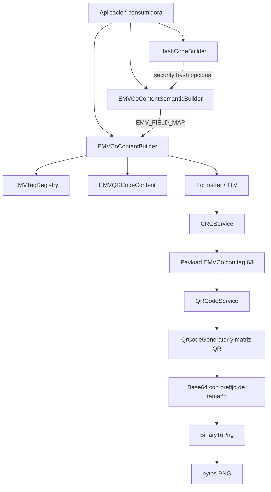
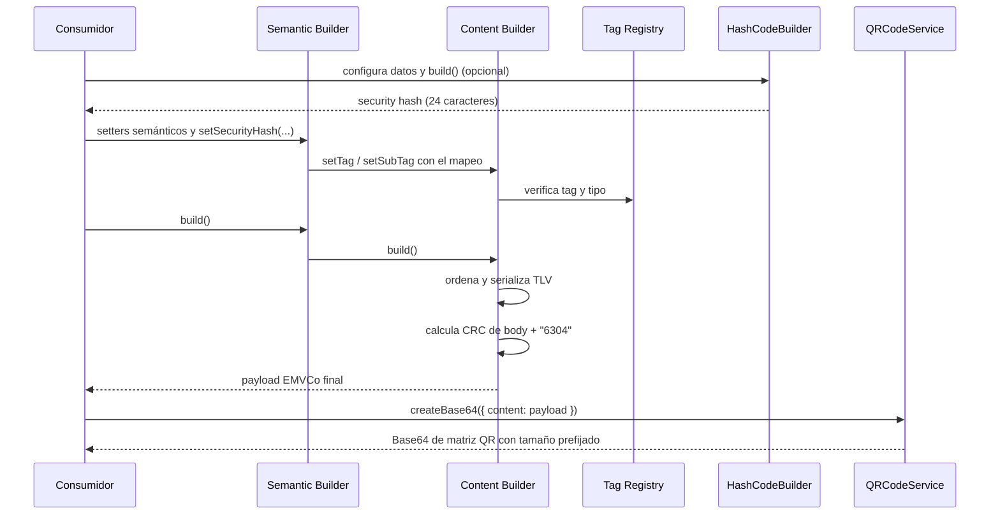

# EMVCode

EMVCode es una librería TypeScript para construir payloads QR basados en EMVCo, generar su representación QR y trabajar con sus utilidades de integridad. Está orientada a integraciones de pago, recaudo o transferencia que necesitan componer campos EMVCo en formato TLV (*tag-length-value*) sin serializar manualmente los campos, ordenarlos o calcular el CRC.

El paquete publicado es `@pragmasa/emvcode`. Se distribuye como CommonJS con declaraciones TypeScript.

## Features

- Builders fluentes para campos EMVCo semánticos o tags TLV de bajo nivel.
- Serialización TLV, ordenamiento de tags/subtags y CRC16-CCITT automático.
- Registro de tags EMVCo, validación de tipo simple/template y límites de longitud.
- Código de seguridad con Web Crypto, QR Base64, decodificación y conversión de matriz binaria a PNG.
- Utilidades binario/hexadecimal y nombres legacy compatibles.

## Table of Contents

- [Architecture](#architecture)
  - [Architecture Overview](#architecture-overview)
  - [Architecture Diagram](#architecture-diagram)
  - [Component Responsibilities](#component-responsibilities)
  - [Data Flow](#data-flow)
  - [Project Structure](#project-structure)
  - [Architectural Decisions](#architectural-decisions)
- [Getting Started](#getting-started)
- [Usage](#usage)
- [API Reference](#api-reference)
- [Testing](#testing)
- [Development](#development)
- [Contributing](#contributing)
- [License](#license)

## Architecture

### Architecture Overview

La API pública empieza en `src/index.ts`. El consumidor puede usar `EMVCoContentSemanticBuilder`, cuyos métodos de negocio se mapean a tags definidos en `EMV_FIELD_MAP`, o `EMVCoContentBuilder`, que recibe tags y subtags directamente.

Ambos builders usan `EMVQRCodeContent` como almacenamiento temporal. `EMVCoContentBuilder` consulta `EMVTagRegistry`, separa campos simples de templates, ordena tags y subtags, los serializa mediante `Formatter` y agrega `6304` más el resultado de `CRCService.calculateCRC16`. Después de `build()`, limpia el estado temporal.

El subsistema QR es independiente del builder EMV: `QRCodeService` usa `QrCodeGenerator`, segmentos, corrección de errores, patrones y matriz QR para convertir texto a Base64. `BinaryToPng` recibe una matriz binaria y produce bytes PNG. Por su parte, `HashCodeBuilder` concatena datos transaccionales y un timestamp, calcula un digest Web Crypto y retorna los primeros 24 caracteres de Base64; incorporarlo como el subtag `91-01` es decisión del consumidor.

### Architecture Diagram



### Component Responsibilities

| Component | Responsabilidad |
| --- | --- |
| `EMVCoContentSemanticBuilder` | Expone setters de dominio, busca su tag/subtag y delega la construcción TLV. |
| `EMVCoContentBuilder` | Valida tipo de tag, conserva campos, ordena, formatea TLV y añade CRC. Produce `string`. |
| `EMVQRCodeContent` | Mantiene `Map`s de campos simples y templates durante la construcción. |
| `EMVTagRegistry` | Describe los tags `00`–`99`, tipo, obligatoriedad y longitudes cuando aplican. |
| `Formatter` | Formatea `tag + longitud de dos dígitos + valor`. |
| `CRCService` | Calcula y valida CRC16-CCITT sobre texto UTF-8. |
| `HashCodeBuilder` | Genera un código Base64 truncado desde datos transaccionales y Web Crypto. |
| `QRCodeService` | Codifica texto en matriz QR Base64 y también lo decodifica. |
| `BinaryToPng` | Convierte una matriz binaria cuadrada en bytes PNG. |
| `EMVTLVService` | Export legacy para parsear, serializar y convertir TLV hacia/desde Base64 QR. |

### Data Flow



El hash no se genera automáticamente ni es requisito de `build()`. El CRC sí se agrega automáticamente. Los setters rechazan valores vacíos, `null`, `undefined` y `N/A`; para tags con longitud máxima, el builder de bajo nivel trunca el valor.

### Project Structure

```text
src/
├── application/                 # Builders y formateador TLV
├── domain/
│   ├── crypto/services/         # CRC16 y hash Web Crypto
│   ├── emv/                     # Entidades, tags, parser y validador TLV
│   └── qr/                      # Matriz, generador, PNG y corrección de errores
├── shared/utils/                # Conversión binario/hexadecimal
├── types/                       # Declaraciones de plataforma/dependencias
├── __tests__/                   # Unitarios, integración y cobertura
└── index.ts                     # Superficie pública del paquete
scripts/
└── obfuscate.js                 # Ofusca JavaScript emitido en dist/
.github/workflows/publish.yml    # Build, test, npm pack y publicación
```

### Architectural Decisions

- **TypeScript-first y librería:** `tsc` emite CommonJS y declaraciones en `dist/`; el paquete expone `dist/index.js` y `dist/index.d.ts`.
- **Builder Pattern fluente:** los setters devuelven `this`; `build()` concluye y consume la configuración.
- **Dos niveles de abstracción:** la API semántica encapsula el mapeo de campos y la de bajo nivel permite controlar tags registrados.
- **Servicios estáticos:** CRC, QR, TLV y conversiones no tienen estado global; el estado de composición es por instancia.
- **QR interno:** generación, segmentos y corrección de errores son implementaciones del repositorio. La única dependencia de producción declarada es `dijkstrajs`.

## Getting Started

### A. Using EMVCode in another project

**Prerequisites:** Node.js `>=16.0.0` y npm. `HashCodeBuilder` requiere Web Crypto (`globalThis.crypto.subtle` o `window.crypto.subtle`).

```bash
npm install @pragmasa/emvcode
```

```ts
import {
  CRCService,
  EMVCoContentSemanticBuilder,
  QRCodeService,
} from "@pragmasa/emvcode";

const payload = new EMVCoContentSemanticBuilder()
  .setPayloadFormatIndicator()
  .setStaticQR()
  .setMerchantCategoryCode("5411")
  .setCurrencyISO4217("170")
  .setCountryCode("CO")
  .setMerchantName("MI TIENDA")
  .setMerchantCity("BOGOTA")
  .build();

const qrBase64 = QRCodeService.createBase64({
  content: payload,
  errorCorrectionLevel: "M",
});

console.log(CRCService.validateCRC16(payload)); // true
console.log(qrBase64);
```

### B. Local Development

```bash
git clone https://github.com/somospragma/backend-architecture-desing-ts-emvco-qr.git
cd backend-architecture-desing-ts-emvco-qr
npm install
npm run build
npm test
```

`npm run build` compila `src/` en `dist/` y ofusca los JavaScript emitidos. `npm test` limpia la caché de Jest y ejecuta la suite con cobertura.

| Command | Resultado |
| --- | --- |
| `npm run clean` | Elimina `dist/`. |
| `npm run build` | Compila TypeScript y ofusca `dist/`. |
| `npm test` | Limpia caché, ejecuta tests y cobertura. |
| `npm run test:watch` | Ejecuta Jest en observación. |
| `npm run test:coverage` | Ejecuta Jest con cobertura. |
| `npm run dev` | Ejecuta `src/index.ts` con `ts-node`; el archivo solo exporta la API. |
| `npm run obfuscate` | Ofusca JavaScript existente en `dist/`. |

### Configuration

La librería no lee variables de entorno, archivos `.env`, credenciales ni servicios externos durante la ejecución. La publicación desde GitHub Actions usa los secretos `PRAGMA_NPM_REGISTRY_URL` y `PRAGMA_NPM_AUTH_TOKEN`; no son necesarios para consumir o desarrollar localmente.

### Verify installation

En un proyecto TypeScript, ejecuta el ejemplo anterior: `CRCService.validateCRC16(payload)` debe imprimir `true`. También se puede comprobar el ciclo QR:

```ts
console.log(QRCodeService.decodeBase64(qrBase64) === payload); // true
```

## Usage

### Quick Start

El ejemplo de [Getting Started](#a-using-emvcode-in-another-project) crea el payload y su matriz QR Base64. `createBase64` devuelve una representación de matriz, no un `data:image/png`.

### Semantic Builder — Recommended

Use `EMVCoContentSemanticBuilder` para campos que ya están definidos por la librería: evita memorizar tags y subtags.

```ts
import { EMVCoContentSemanticBuilder, EMVField } from "@pragmasa/emvcode";

const acquirer = "COM.CO.MIPAGO";
const payload = new EMVCoContentSemanticBuilder()
  .setPayloadFormatIndicator()
  .setDynamicQR()
  .setMerchantAccountGUI(`${acquirer}.LLA`)
  .setMerchantAccountId("27899526", EMVField.MERCHANT_ACCOUNT_MERCHANT_ID)
  .setMerchantCategoryCode("5411")
  .setCurrencyISO4217("170")
  .setTransactionAmount("75000")
  .setCountryCode("CO")
  .setMerchantName("SUPERMERCADO")
  .setMerchantCity("CALI")
  .setAdditionalTerminalLabel("CAJA-01")
  .build();
```

### Low-Level Builder

Use `EMVCoContentBuilder` cuando necesite controlar tags registrados explícitamente. `setTag` acepta únicamente tags simples y `setSubTag`, templates.

```ts
import { EMVCoContentBuilder } from "@pragmasa/emvcode";

const payload = new EMVCoContentBuilder()
  .setTag("00", "01")
  .setTag("01", "12")
  .setTag("52", "5411")
  .setTag("53", "170")
  .setTag("58", "CO")
  .setTag("59", "MI TIENDA")
  .setTag("60", "BOGOTA")
  .setSubTag("26", "00", "COM.CO.MIPAGO.LLA")
  .setSubTag("26", "05", "27899526")
  .build();
```

### Generating Security Hash

`HashCodeBuilder` forma una cadena con código único, canal, terminal, transacción, monto y timestamp; aplica el algoritmo configurado (por defecto `SHA-256`), codifica el digest en Base64 y toma los primeros 24 caracteres.

```ts
import { HashCodeBuilder } from "@pragmasa/emvcode";

const securityHash = await new HashCodeBuilder()
  .setUniqueCode("27899526")
  .setChannel("POS")
  .setTerminalId("CAJA-01")
  .setTransactionId("TRX-1001")
  .setTransactionAmount("75000")
  .setTimestamp(1735689600000)
  .build();
```

Llame `setAlgorithmIdentifier("SHA-384")` antes de `build()` para cambiar el algoritmo; ese método configura la instancia y no es fluente. Incorpore el resultado con `setSecurityHashGui(...)` y `setSecurityHash(...)` si corresponde.

### Generating QR Images

`QRCodeService.createBase64` produce la matriz QR serializada. `BinaryToPng` convierte sus bits a PNG:

```ts
import { BinaryToPng, QRCodeService } from "@pragmasa/emvcode";

const encoded = QRCodeService.createBase64({ content: payload, errorCorrectionLevel: "L" });
const size = Number.parseInt(encoded.slice(0, 2), 10);
const bits = BinaryToPng.base64ToBinary(encoded.slice(2)).replaceAll(/\s+/g, "");
const png = await BinaryToPng.binaryToPNG({
  binary: bits.slice(0, size * size),
  rows: size,
  reversed: true,
  scale: 8,
});

// Node.js: require("node:fs").writeFileSync("qr.png", Buffer.from(png));
```

El prefijo puede tener dos o tres dígitos. Para Base64 genérico (`createBase64(config, true)`), proporcione el tamaño a `decodeBase64(input, { genericImage: true, size })`.

### Complete Example

```ts
import {
  EMVCoContentSemanticBuilder,
  EMVField,
  HashCodeBuilder,
  QRCodeService,
} from "@pragmasa/emvcode";

const acquirer = "COM.CO.MIPAGO";
const merchantId = "27899526";
const transactionId = "TRX-1001";
const amount = "75000";
const hash = await new HashCodeBuilder()
  .setUniqueCode(merchantId).setChannel("POS").setTerminalId("CAJA-01")
  .setTransactionId(transactionId).setTransactionAmount(amount)
  .setTimestamp(1735689600000).build();

const payload = new EMVCoContentSemanticBuilder()
  .setPayloadFormatIndicator().setDynamicQR()
  .setMerchantAccountGUI(`${acquirer}.LLA`)
  .setMerchantAccountId(merchantId, EMVField.MERCHANT_ACCOUNT_MERCHANT_ID)
  .setMerchantCategoryCode("5411").setCurrencyISO4217("170")
  .setTransactionAmount(amount).setCountryCode("CO")
  .setMerchantName("MI TIENDA").setMerchantCity("BOGOTA")
  .setTransactionIdGui(`${acquirer}.TRXID`).setTransactionId(transactionId)
  .setSecurityHashGui(`${acquirer}.SEC`).setSecurityHash(hash)
  .build();

const qrBase64 = QRCodeService.createBase64({ content: payload, errorCorrectionLevel: "M" });
```

## API Reference

### Public exports

| Export | Uso |
| --- | --- |
| `EMVCoContentSemanticBuilder` / `EMVCoContentBuilder` | Construcción de payloads. |
| `EMVTag`, `TagType`, `EMVTagValue`, `EMVTagRegistry`, `EMVField`, `keyType`, `TypeConditionValue` | Tipos, registro y campos EMV. |
| `QRCodeService`, `QRConfig` | Codificación y decodificación QR. |
| `CRCService`, `HashCodeBuilder`, `BinaryHexConverter`, `BinaryToPng` | Servicios y conversiones. |
| `EMVTLVService` | Export legacy para parsear/stringificar TLV y convertirlo a/desde Base64 QR. |

Por compatibilidad también se exportan `EMVCoQRContentBuilder`, `EMVCoQrContentSemanticBuilder`, `QrCodeImage`, `Crc` y `CRCUtils`.

### Semantic Builder fields

| Grupo | Métodos |
| --- | --- |
| Inicio | `setPayloadFormatIndicator`, `setDynamicQR`, `setStaticQR` |
| Cuenta/adquirente | `setAcquirerNetworkId`, `setMerchantAccountGUI`, `setMerchantAccountId`, `setNetworkGUI`, `setNetworkId`, `setMerchantCodeGUI`, `setMerchantCode`, `setAggregatorCodeGUI`, `setAggregatorCode` |
| Comercio/transacción | `setMerchantCategoryCode`, `setCurrencyISO4217`, `setTransactionAmount`, `setTipIndicator`, `setTipFixedAmount`, `setTipPercentage`, `setCountryCode`, `setMerchantName`, `setMerchantCity`, `setPostalCode` |
| Datos adicionales | `setAdditionalBillNumber`, `setAdditionalMobileNumber`, `setAdditionalStoreLabel`, `setAdditionalLoyaltyNumber`, `setAdditionalReferenceLabel`, `setAdditionalCustomerLabel`, `setAdditionalTerminalLabel`, `setAdditionalPurpose`, `setAdditionalConsumerData`, `setAdditionalMerchantTaxId`, `setAdditionalChannelOrigin` |
| Idioma, canal e impuestos | `setLanguagePreference`, `setMerchantNameAlt`, `setMerchantCityAlt`, `setChannelGui`, `setChannel`, `setVATConditionGui`, `setVATCondition`, `setVATValueGui`, `setVATValue`, `setVATBaseGui`, `setVATBase`, `setINCConditionGui`, `setINCCondition`, `setINCValueGui`, `setINCValue` |
| Seguridad y operaciones | `setTransactionIdGui`, `setTransactionId`, `setSecurityHashGui`, `setSecurityHash`, `setServiceCode`, `setReferenceOrMobileGui`, `setReferenceOrMobile`, `setProductTypeCollection`, `setOriginAccount`, `setDestinationAccount`, `setDestinationAccountReference`, `setProductTypeTransference`, `setDiscountApplicationGui`, `setDiscountApplication` |

Los setters devuelven el builder. `build(): string` devuelve el payload y reinicia el contenido. Los valores de condición son `"01"`, `"02"` o `"03"`.

### Supporting APIs

- `CRCService.calculateCRC16(data)` devuelve un CRC hexadecimal de cuatro caracteres; `validateCRC16(qrData)` valida los cuatro últimos caracteres.
- `HashCodeBuilder` configura `setUniqueCode`, `setChannel`, `setTerminalId`, `setTransactionId`, `setTransactionAmount`, `setTimestamp` y `setAlgorithmIdentifier`; `build()` es asíncrono.
- `QRCodeService.createBase64(config, genericImage?)` y `decodeBase64(input, config?)` codifican/decodifican texto. `QRConfig` acepta `content`, `version`, `errorCorrectionLevel` y `width` (este último no se utiliza actualmente).
- `BinaryToPng.base64ToBinary(base64)` obtiene bits; `binaryToPNG({ binary, rows, scale?, reversed?, foreground?, background? })` devuelve `Promise<Uint8Array>`.
- `BinaryHexConverter.hexToBinary(hex)` y `binaryToHex(binary)` convierten entre ambas representaciones y rechazan entradas inválidas.

### Tags EMV principales

| Tag | Tipo | Descripción en el registro |
| --- | --- | --- |
| `00`, `01` | Simple | Indicador de formato y método de iniciación. |
| `26`–`51` | Template | Información de cuenta del merchant. |
| `52`–`61` | Simple | Comercio, moneda, monto y propina. |
| `62` | Template | Datos adicionales. |
| `63` | Simple | CRC; se agrega en `build()`. |
| `64` | Template | Idioma alternativo. |
| `80`–`99` | Template | Canal, impuestos, seguridad y operaciones. |

Para el detalle completo, use `EMVTagRegistry.getTag(tag)` o `EMVTagRegistry.getAllTags()`.

## Testing

La suite usa Jest con `ts-jest` y busca `*.test.ts` en `src/**/__tests__/`. Cubre builders, CRC, hash, TLV, matriz QR, segmentos, Reed-Solomon, PNG, conversiones e integración. La configuración exige globalmente 85% para branches, functions, lines y statements en los archivos incluidos.

```bash
npm test
npm run test:coverage
npm run test:watch
```

Los reportes se generan en `coverage/` como texto, LCOV y HTML.

## Development

Instale dependencias, agregue o actualice pruebas en `src/__tests__/`, ejecute `npm run build` y `npm test`. El workflow de publicación en `.github/workflows/publish.yml` se activa con pushes a `main`: ejecuta Node 20, `npm ci`, build, tests, `npm pack --dry-run` y publicación npm.

La distribución npm contiene solamente `dist/**/*`. Antes de publicar, `prepublishOnly` ejecuta `clean`, `build` y `test`.

## Contributing

Consulta [CONTRIBUTING.md](./CONTRIBUTING.md) para la guía existente. Mantén los ejemplos alineados con `src/index.ts`, incluye pruebas para cambios de comportamiento y ejecuta build y tests antes de proponer un cambio.

## License

Este proyecto se distribuye bajo licencia [Apache-2.0](./LICENSE).
